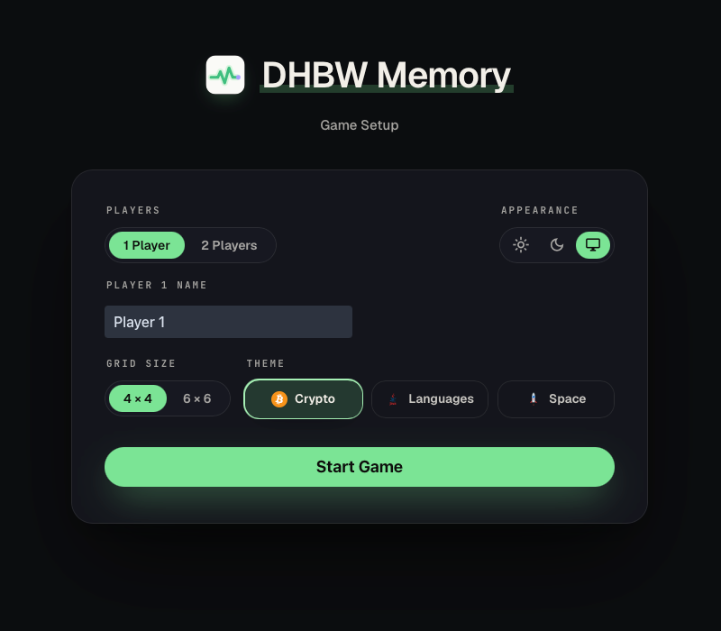
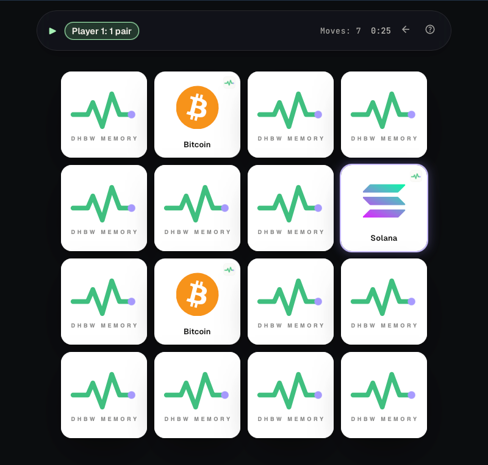

# DHBW Memory

A Java-based **Memory** card game built with **Spring Boot** and **Vaadin**.
University exam project for **DHBW Ravensburg Campus Friedrichshafen**, course *Programmieren Java*.

Runs locally as a single executable fat jar (embedded Tomcat → browser at
`localhost:8080`) and as a Docker container behind nginx at
<https://memory.walletpulse.de>.

<p align="center">
  
  
</p>

---

## Quick start

You need **Java 21** and **Maven 3.9+**. If your default `java` is a newer
JDK (25+), pin Maven to JDK 21 first, otherwise the Vaadin frontend plugin
fails with *"Unsupported class file major version"*:

```bash
export JAVA_HOME=$(/usr/libexec/java_home -v 21)   # macOS
# or:  export JAVA_HOME=/path/to/jdk-21            # Linux / Windows (Git Bash)
```

```bash
# Run from source (dev mode, hot reload)
mvn spring-boot:run
# → open http://localhost:8080

# Build the standalone executable fat jar.
# The "production" profile compiles the Vaadin frontend into the jar,
# so the resulting artifact runs without npm / Vite installed.
mvn clean package -P production
java -jar target/DHBW-Memory-Markus-Wenninger.jar

# Generate JavaDoc → target/reports/apidocs/index.html
mvn javadoc:javadoc

# Run all tests (59 unit tests covering model + controller)
mvn test
# or: ./mvnw test     # uses the bundled Maven wrapper, no global mvn required
```

### Docker

A multi-stage `Dockerfile` is included (`maven:3.9.9-eclipse-temurin-21` build →
`eclipse-temurin:21.0.7_6-jre-alpine` runtime):

```bash
docker build -t dhbw-memory .
docker run --rm -p 8080:8080 dhbw-memory
```

---

## Features

- **1 or 2 players** — local hot-seat
- **4×4 (8 pairs)** or **6×6 (18 pairs)** grids
- **Three card themes:** Crypto, Languages, Space — each is a set of custom SVGs
- **Light / Dark / System** color modes — the choice is persisted in `localStorage` and applied before paint, so there is no flash on reload
- **Full keyboard navigation** — arrow keys to move, Space / Enter to flip
- **Live game timer** in the status bar and the browser tab title
- **Per-player stats** (turns, accuracy) and confetti on win
- Bundled **JavaDoc** at [`/docs/index.html`](http://localhost:8080/docs/index.html) and an HTML **test report** at [`/tests/index.html`](http://localhost:8080/tests/index.html)

---

## Tech stack

| Component | Choice |
|---|---|
| Language | Java 21 |
| Build | Maven |
| Server | Spring Boot 3.4 (embedded Tomcat) |
| UI | Vaadin 24 (pure-Java web UI) |
| Tests | JUnit 5 |

Vaadin lets the entire UI be written in Java — no separate frontend project
to maintain — while still producing a real web application that runs in any
modern browser.

---

## Architecture

The codebase follows a strict **MVC** layering. The `model` package contains
pure Java and **must not import Spring or Vaadin**; this keeps the game logic
testable and framework-independent.

```
src/main/java/de/dhbw/memory/
├── MemoryApplication.java          @SpringBootApplication entry point
├── model/                          pure Java — Card, Player, Board, Game, Theme, FlipResult
├── controller/
│   └── GameService.java            @Service @UIScope — orchestrates moves, async flip-back
└── view/                           Vaadin views; never mutates model state directly
    ├── StartView.java              @Route("")        configuration screen
    ├── GameView.java               @Route("game")    board + status bar + dialogs
    ├── component/                  MemoryCard, SegmentedControl
    └── dialog/                     HelpDialog, QuitConfirmDialog, EndGameDialog
```

**UML class diagram:** [`docs/uml/DHBW_Memory_UML_Diagram_Markus_Wenninger.png`](docs/uml/DHBW_Memory_UML_Diagram_Markus_Wenninger.png) (source: [`.puml`](docs/uml/DHBW_Memory_UML_Diagram_Markus_Wenninger.puml))

---

## Tests

**59 JUnit 5 tests** covering the game logic (model) and the orchestrator
(controller). The model layer is pure Java, so tests run in milliseconds
without spinning up Spring or Vaadin.

| Suite | Package | Tests |
|---|---|---|
| `GameServiceTest` | `controller` | 12 |
| `GameTest` | `model` | 19 |
| `BoardTest` | `model` | 7 |
| `CardTest` | `model` | 7 |
| `PlayerTest` | `model` | 7 |
| `ThemeTest` | `model` | 7 |

```bash
./mvnw test    # → 59 tests, 0 failures, 0 errors, 0 skipped
```

A browsable HTML test report (per-suite breakdown + full `./mvnw test`
console output) is bundled into the fat jar and served at
[`/tests/index.html`](http://localhost:8080/tests/index.html) once the
app is running. JavaDoc is bundled the same way at
[`/docs/index.html`](http://localhost:8080/docs/index.html).
Note: the date and Maven log timestamp inside `static/tests/index.html` are
hand-edited before each submission build — they are not updated automatically.

---

## Themes

Three card themes are bundled — every motif is a custom SVG that renders
crisply on the white card face.

| Theme | Motifs (4×4 / 6×6) |
|---|---|
| **Crypto** | Bitcoin, Ethereum, Solana, … (8 / 18 coins) |
| **Languages** | Java, Python, JavaScript, … (8 / 18 programming languages) |
| **Space** | Rocket, Astronaut, Moon, … (8 / 18 space motifs) |

The card back is a unified WalletPulse-branded SVG.

---

**Course**: Programmieren – Java · **University**: DHBW Ravensburg Campus Friedrichshafen · **Author**: Markus Wenninger

**License**: [MIT](LICENSE)
